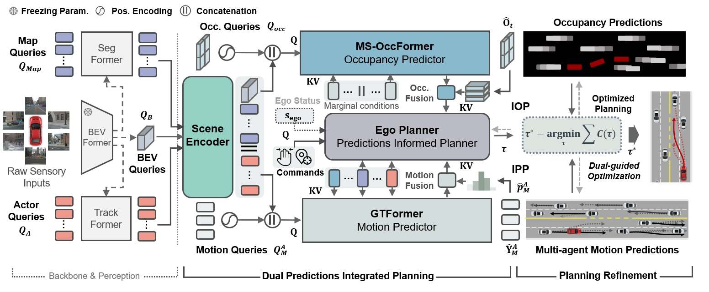

# HPP

This repo is the implementation of the following paper:

**Hybrid Prediction Integrated Planning for Autonomous Driving**
  [Haochen Liu](https://scholar.google.com/citations?user=iizqKUsAAAAJ&hl=en), [Zhiyu Huang](https://mczhi.github.io/), [Wenhui Huang](https://scholar.google.com/citations?user=Hpatee0AAAAJ&hl=en), [Haohan Yang](https://scholar.google.com/citations?user=KmKMahwAAAAJ&hl=en), [Xiaoyu Mo](https://scholar.google.com/citations?user=JUYVmAQAAAAJ&hl=zh-CN),  [Chen Lv](https://scholar.google.com/citations?user=UKVs2CEAAAAJ&hl=en)
  [AutoMan Research Lab, Nanyang Technological University](https://lvchen.wixsite.com/automan)
  **[[Project Website]](https://georgeliu233.github.io/HPP/)**

https://github.com/georgeliu233/HPP/assets/46886579/55ed43b6-1e73-45a1-8180-b371c0666e44

# Get Started

### 1.Codes
Full code will be released soon

### 2.Downloads
Model weights and logs will be released soon

# Useful Resources

Official release for our previous work: 

-[DIPP](https://github.com/MCZhi/DIPP) 🔥 

-[GameFormer](https://github.com/MCZhi/GameFormer) 🚀 

-[STrajNet](https://github.com/georgeliu233/STrajNet) 🚀 

-[OPGP](https://github.com/georgeliu233/OPGP) 🚀 

We also acknowledge the immense assistance and proofread from [Li Chen](https://scholar.google.com/citations?user=ulZxvY0AAAAJ&hl=en) [@OpenDriveLab](https://github.com/OpenDriveLab) and the open-source repo:

-[UniAD](https://github.com/OpenDriveLab/UniAD)

-[ST-P3](https://github.com/OpenDriveLab/ST-P3)
