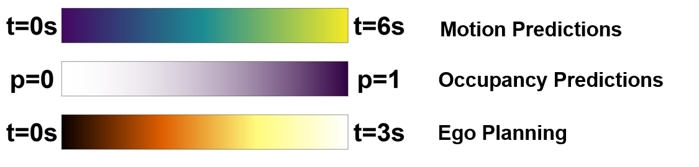
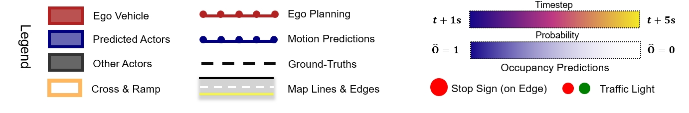

# Hybrid Predictions Integrated Planning for Autonomous Driving
[Haochen Liu](https://scholar.google.com/citations?user=iizqKUsAAAAJ&hl=en), [Zhiyu Huang](https://mczhi.github.io/),[Wenhui Huang](https://scholar.google.com/citations?user=Hpatee0AAAAJ&hl=en),[Haohan Yang](https://scholar.google.com/citations?user=KmKMahwAAAAJ&hl=en), [Xiaoyu Mo](https://scholar.google.com/citations?user=JUYVmAQAAAAJ&hl=zh-CN), [Chen Lv](https://scholar.google.com/citations?user=UKVs2CEAAAAJ&hl=en)

[AutoMan Research Lab, Nanyang Technological University](https://lvchen.wixsite.com/automan)

## Abstract 
Autonomous driving systems require the ability to fully understand and predict the surrounding environment to make informed decisions in complex scenarios. Recent advancements in learning-based systems have highlighted the importance of integrating prediction and planning modules. However, this integration has brought forth three major challenges: inherent trade-offs by sole prediction, consistency between prediction patterns, and social coherence in prediction and planning. To address these challenges, we introduce a hybrid-predictions integrated planning (HPP) system, which possesses three novelly designed modules. First, we introduce marginal-conditioned occupancy prediction to align joint occupancy with agent-wise perceptions. Our proposed MS-OccFormer module achieves multi-stage alignment per occupancy forecasting with consistent awareness from agent-wise motion predictions. Second, we propose a game-theoretic motion predictor, GTFormer, to model the interactive future among individual agents with their joint predictive awareness. Third, hybrid prediction patterns are concurrently integrated with Ego Planner and optimized by prediction guidance. HPP achieves state-of-the-art performance on the nuScenes dataset, demonstrating superior accuracy and consistency for end-to-end paradigms in prediction and planning. Moreover, we test the long-term open-loop and closed-loop performance of HPP on the Waymo Open Motion Dataset and CARLA benchmark, surpassing other integrated prediction and planning pipelines with enhanced accuracy and compatibility.

## Method Overview 

Systematic overview of the proposed Hybrid predictions integrated planning (***HPP***) framework. DPP is established upon query-based ADS co-design optimizations of interactive planning with dual predictions integration (IPP and IOP), informed by BEV perceptions. With encoded perception scene context, DPP delivers predictions planning co-design in three-fold. Joint occupancy prediction are iteratively refined in **MS-OccFormer**, sharing mutual consistency over marginal motion prediction in **GTFormer**, which performs interactive reasoning between marginal prediction and planning. Reasoned outcomes and ego features are served to query dual predictions-aware planning in **Ego Planner**. Eventually, optimizations are scheduled to refine planning with dual predictions guidance.

## Open-loop Planning (nuScenes)
The planner outputs a planned trajectory at 2Hz. All agents are roll-outed by log-replay per timestep in the dataset. 

| <video muted controls width=380> <source src="./vids/1.mp4"  type="video/mp4"> </video> | <video muted controls width=380> <source src="./vids/2.mp4"  type="video/mp4"> </video> |

| <video muted controls width=380> <source src="./vids/3.mp4"  type="video/mp4"> </video> | <video muted controls width=380> <source src="./vids/5.mp4"  type="video/mp4"> </video> |

| <video muted controls width=380> <source src="./vids/6.mp4"  type="video/mp4"> </video> | <video muted controls width=380> <source src="./vids/7.mp4"  type="video/mp4"> </video> |

## Closed-loop Planning (WOMD)
The planner outputs and optimizes a planned trajectory at 2Hz. The ego vehicle’s state are simulated accordingly at future time steps. The other agents are replayed from the log according to their observed states in the dataset.

| <video muted controls width=380> <source src="./vids/2ef8b857eb575693 (1).mp4"  type="video/mp4"> </video> | <video muted controls width=380> <source src="./vids/45c6cd9309b3ce87.mp4"  type="video/mp4"> </video> |

| <video muted controls width=380> <source src="./vids/5bcb4673b6c09a82.mp4"  type="video/mp4"> </video> | <video muted controls width=380> <source src="./vids/93a82dbe9425898c.mp4"  type="video/mp4"> </video> |

| <video muted controls width=380> <source src="./vids/a1bdf5c2af01557a.mp4"  type="video/mp4"> </video> | <video muted controls width=380> <source src="./vids/c45f2781605c47f0.mp4"  type="video/mp4"> </video> |

## Acknowledgements

Official release for our previous work: 

-[DIPP](https://github.com/MCZhi/DIPP) 

-[GameFormer](https://github.com/MCZhi/GameFormer) 

-[STrajNet](https://github.com/georgeliu233/STrajNet) 

-[OPGP](https://github.com/georgeliu233/OPGP) 
