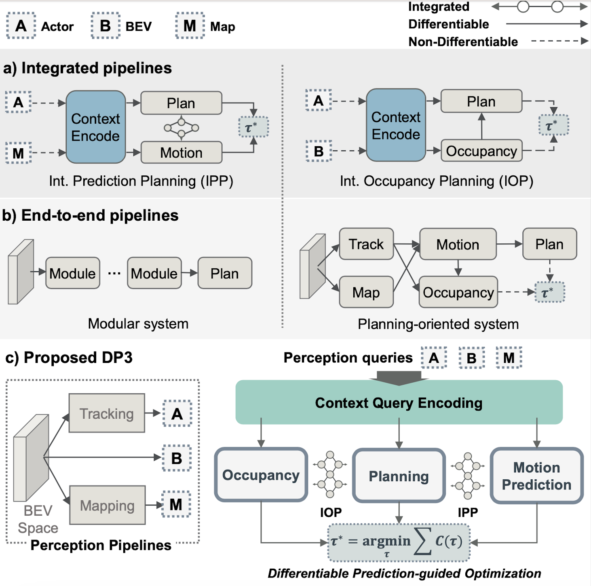
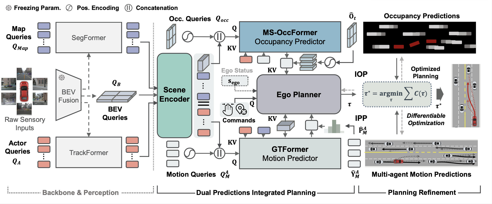

# Dual Predictions Integrated Planning for Autonomous Driving
[Haochen Liu](https://scholar.google.com/citations?user=iizqKUsAAAAJ&hl=en), [Zhiyu Huang](https://mczhi.github.io/),[Wenhui Huang](https://scholar.google.com/citations?user=Hpatee0AAAAJ&hl=en),[Haohan Yang](https://scholar.google.com/citations?user=KmKMahwAAAAJ&hl=en),[Zhiyu Huang](https://mczhi.github.io/), [Xiaoyu Mo](https://scholar.google.com/citations?user=JUYVmAQAAAAJ&hl=zh-CN), [Chen Lv](https://scholar.google.com/citations?user=UKVs2CEAAAAJ&hl=en)

[AutoMan Research Lab, Nanyang Technological University](https://lvchen.wixsite.com/automan)

## Abstract 
Autonomous driving systems must have the ability to fully understand and predict their surrounding agents to make informed decisions in complex real-world scenarios. While recent advancements in learning-based systems have highlighted the integration between prediction and planning modules, they have also brought three major challenges: accurate predictions that align with perceptions, consistency between joint and agent-wise prediction patterns, and social coherence in prediction and planning. Inspired by this integrative nature, we introduce DP3, a dual-predictions integrated planning system that harnesses differentiable integration between prediction and planning. With context queries perceived from the bird's-eye view (BEV) space that are collectively encoded, DP3 tackles the aforementioned challenges through three modules. First, we introduce occupancy prediction to align joint predictions with perceptions. Our proposed MS-OccFormer module aims to achieve multi-stage alignment per occupancy forecasting with consistent awareness from agent-wise motion predictions. Second, we propose a game-theoretic motion predictor termed GTFormer to model the interactive future among individual agents with their joint predictive awareness. Dual prediction patterns are concurrently integrated with Ego Planner and optimized with prediction guidance. DP3 achieves state-of-the-art performance on the nuScenes dataset, demonstrating superior accuracy, safety, and consistency for end-to-end paradigms in prediction and planning. Moreover, we also report the long-term open-loop and closed-loop performance of DP3 on the Waymo Open Motion Dataset and CARLA benchmark, demonstrating enhanced accuracy and compatibility over other integrated prediction and planning pipelines.

## Method Overview 

Systematic overview of the proposed Dual predictions integrated planning (***DP3***) framework. DP3 is established upon query-based ADS co-design optimizations of interactive planning with dual predictions integration (IPP and IOP), informed by BEV perceptions. With encoded perception scene context, DP3 delivers predictions planning co-design in three-fold. Joint occupancy prediction are iteratively refined in **MS-OccFormer**, sharing mutual consistency over marginal motion prediction in **GTFormer**, which performs interactive reasoning between marginal prediction and planning. Reasoned outcomes and ego features are served to query dual predictions-aware planning in **Ego Planner**. Eventually, optimizations are scheduled to refine planning with dual predictions guidance.

## Acknowledgements

Official release for our previous work: 

[DIPP](https://github.com/MCZhi/DIPP); 

[GameFormer](https://github.com/MCZhi/GameFormer)
